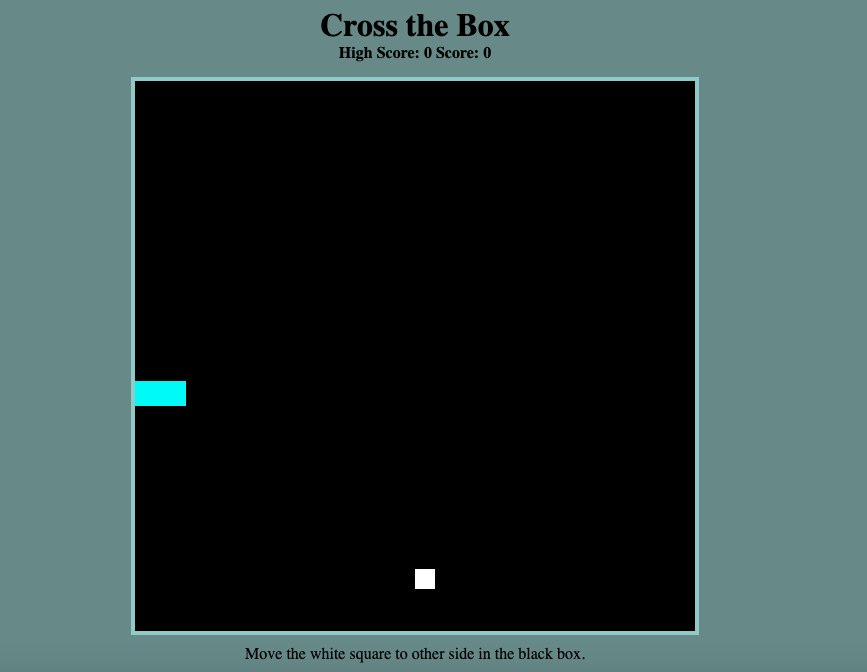

# Cross the Box Game

A simple canvas game where you control a white block and try to reach the top of the screen without hitting blue obstacle blocks.



## Technologies Used

- JavaScript (ES6+)
- HTML5 Canvas
- CSS3
- npm for development server

## Game Features

- Responsive design works on both desktop and mobile devices
- Touch controls for mobile gameplay
- Frame-rate independent animation for consistent gameplay on all devices
- Difficulty increases as your score increases
- Simple one-button restart

## How to Play

The point of the game is to get the white block to the other side of the canvas without hitting the blue blocks. The speed and number of blocks increase based on your score.

- Use arrow keys to move on desktop
- Swipe to move on mobile devices
- Press 'R' to restart the game

## Development Setup

### Prerequisites

- Node.js (version 12 or higher)
- npm (comes with Node.js)

### Running Locally

1. Clone this repository or download the code
2. Navigate to the project directory in your terminal
3. Install dependencies:
   ```
   npm install
   ```
4. Start the development server:
   ```
   npm run dev
   ```
   or
   ```
   npm start
   ```

This will automatically open the game in your default browser at `http://localhost:8080`.

## What I Learned Building This Game

I learned how to use classes and DOM manipulation. I started out hard coding where the blue blocks would appear, the size of the blue blocks, and how many blue blocks would be rendered in the canvas. This created a problem of WET (Write Everything Twice) code and limited the scope of the project.

### Using Classes

Using classes unlocked a whole new potential. I no longer had to hard code the size, position, or amount of blue blocks that would cross the canvas. I could also base the speed and amount of blocks upon the score. I was also able to randomize where the blue blocks would start along the y-axis of the canvas.

### Responsive Design

The latest version includes responsive design principles, making the game playable on devices of all sizes. The game elements scale proportionally based on the screen size.

## Target Users

This game is designed to be accessible to players of all ages and experience levels:

- Casual gamers looking for a quick, simple game
- Mobile users who want a responsive touch experience
- Players of all ages (5 to 75+) who enjoy simple arcade-style games
- People looking for a quick distraction during breaks
