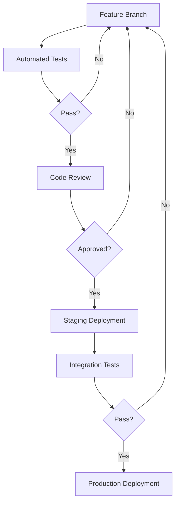

# ASCEND & AVOID

<div align="center">


[](https://github.com/yourusername/ascend-avoid)
[](https://github.com/yourusername/ascend-avoid)
[](https://github.com/yourusername/ascend-avoid)
[](LICENSE)
[](package.json)
[](tsconfig.json)

</div>

## 🚀 Overview

**Ascend & Avoid** is a high-performance, real-time multiplayer arcade game built on cutting-edge web technologies. Players navigate through dynamically generated obstacles in a race to the top, competing against up to 30 simultaneous players in a fast-paced environment.

The project demonstrates expertise in:

- **Advanced Canvas Rendering Techniques** with optimized frame-by-frame calculations
- **Real-time Networking** using WebSockets with delta compression
- **Scalable Architecture** following Domain-Driven Design principles
- **Cross-platform Compatibility** from mobile to desktop with responsive design

---

## 🏗️ Architecture

The application follows a **Clean Architecture** approach with strict separation of concerns:


### Core Domains

| Domain | Responsibility | Key Patterns |
|--------|----------------|--------------|
| **Game Core** | Core game mechanics and rules | Entity-Component, State Pattern |
| **Rendering** | Canvas drawing and animations | Strategy Pattern, Command Pattern |
| **Input** | User interaction handling | Observer Pattern, Adapter Pattern |
| **Networking** | Multiplayer synchronization | CQRS, Event Sourcing |
| **UI** | Interface rendering and state management | MVC, Composite Pattern |

### Technical Highlights

- **Event-driven Architecture** for loose coupling between components
- **Optimized Object Pooling** for garbage-collection-free gameplay
- **WebWorker Parallelization** for physics calculations
- **Adaptive Performance Scaling** based on device capabilities

---

## 🛠️ Technologies

<div align="center">


</div>

### Frontend Stack

- **Rendering Engine**: Custom-built Canvas API abstraction layer
- **Module Bundling**: Vite with hot module replacement
- **State Management**: Custom implementation with Proxy-based reactivity
- **Animation System**: RequestAnimationFrame with delta-time interpolation

### Backend Stack

- **Server Framework**: Node.js with Express
- **Multiplayer Engine**: Colyseus with schema-based state synchronization
- **Protocol**: Custom binary protocol over WebSockets for minimal bandwidth

---

## 🚀 Performance Optimizations

The game achieves **60+ FPS** even on mid-range mobile devices through:

1. **Selective Rendering** with dirty rectangle tracking
2. **Asset Pre-loading** and progressive enhancement
3. **Spatial Partitioning** for collision detection optimization
4. **Texture Atlasing** to minimize draw calls
5. **Memory Management** with sophisticated object pooling

---

## 📊 Scalability

The multiplayer architecture supports:

- **Horizontal Scaling** with stateless server design
- **Regional Server Deployment** via cloud infrastructure
- **Match Orchestration** for optimal player grouping
- **Graceful Degradation** under high load conditions

---

## 🔄 Development Workflow

The project employs a professional development workflow:



### CI/CD Pipeline

- **Automated Testing**: Jest for unit tests, Playwright for E2E
- **Performance Benchmarking**: Lighthouse and custom timing metrics
- **Deployment**: Multi-stage process with canary releases

---

## 🏆 Architecture Principles

The codebase strictly adheres to:

- **SOLID Principles** throughout the class hierarchy
- **DRY (Don't Repeat Yourself)** with meticulous refactoring
- **KISS (Keep It Simple, Stupid)** for maintainable code
- **Law of Demeter** to minimize coupling
- **Single Responsibility Principle** at component level

---

## 📱 Cross-Platform Support

Fully responsive design that adapts to:

- **Desktop** with keyboard controls
- **Mobile** with touch-optimized interface
- **Tablets** with hybrid controls
- **Multiple orientations** with dynamic layout adaptation

---

## 🚀 Getting Started

### Prerequisites

```bash
node -v  # Must be ≥ 16.0.0
npm -v   # Must be ≥ 8.0.0
```

### Installation

```bash
# Clone repository
git clone https://github.com/yourusername/ascend-avoid.git
cd ascend-avoid

# Install dependencies
npm install

# Start development server
npm run dev

# For multiplayer testing
npm run server
```

---

## 🔮 Future Roadmap

- **WebGL Rendering Pipeline** for advanced visual effects
- **AI Opponents** using reinforcement learning
- **Progressive Web App** conversion with offline support
- **Cross-platform Desktop Clients** via Electron
- **VR Mode** with immersive gameplay experience

---

<div align="center">

**Ascend & Avoid** — Demonstrating excellence in real-time web application architecture

[GitHub](https://github.com/yourusername/ascend-avoid) | [Play Now](https://ascend-avoid.example.com) | [Documentation](https://docs.ascend-avoid.example.com)

</div>
